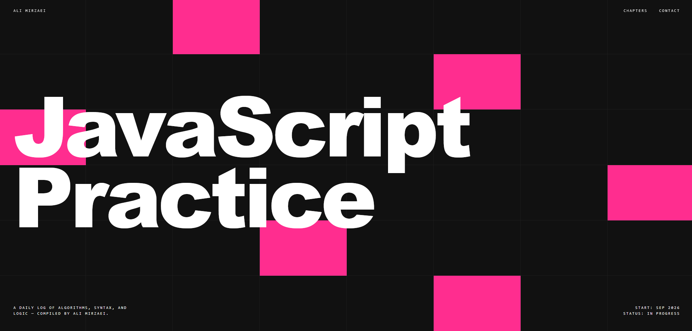
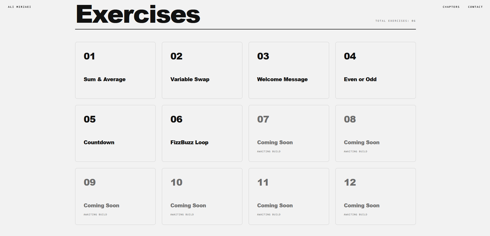
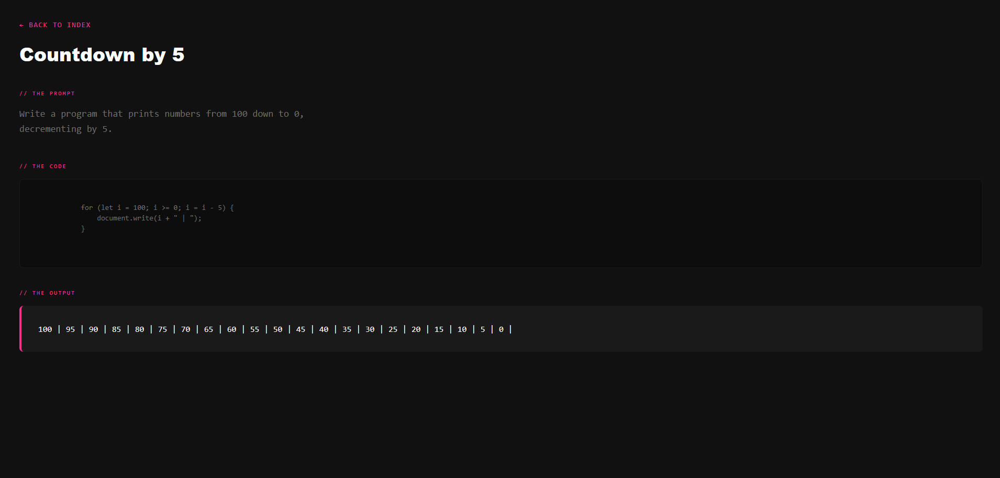

# JavaScript Practice

A personal journal of small, front-end practice exercises documenting my journey through learning JavaScript fundamentals.

Each exercise focuses on a specific **JavaScript operator, logic structure, or syntax**.

## Table of Contents

- [Demo](#demo)
- [Screenshots](#screenshots)
- [Tech Stack](#tech-stack)
- [Project Structure](#project-structure)
- [Author](#author)

## Demo

[Live Demo](https://ali-mirzaei-dev.github.io/JS-Practice/)

## Screenshots

**Homepage & Hero Section:**
<br>


<br>

**Exercises Index:**
<br>


<br>

**Practice Page (Terminal Output):**
<br>


## Tech Stack

| Technology | Purpose |
|---|---|
| HTML 5 | Semantic markup |
| CSS 3 | Custom styling & base layer variables |
| Java Script | Algorithms, operators, and conditional logic |
| Tailwind CSS | Utility-first styling & responsive design |

## Project Structure

```text
JS-Practice/
│
├── Exercises/
│   ├── Exercise-01/
│   ├── Exercise-02/
│   ├── ...
│
├── assets/
│   ├── Font/
│   ├── Images/
│   └── StyleSheet/
│
└── index.html
```

## Author

**Ali Mirzaei** – Frontend Developer

- [GitHub](https://github.com/ali-mirzaei-dev)
- [LinkedIn](https://www.linkedin.com/in/ali-mirzaei-dev/)
- [Instagram](https://instagram.com/ali.mirzaei.dev)
- [ali.mirzaei.kt@gmail.com](mailto:ali.mirzaei.kt@gmail.com)